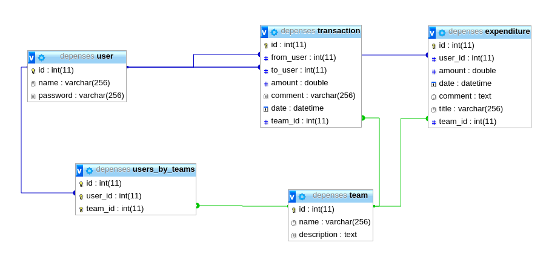

# Dépenses.py

The purpose of this web app is to organize a budget within a group with shared expenditures.

*Live demo :* http://vps.yann-p.fr/depenses

## Features

 - Keep track of expenditures and reimbursements within groups
 - Calculates who owns money to who (takes expentidures and reimbursements in account)
 - Very easy to use user system
 - Translated in English and in French.

## Author
Yann Pellegrini \<mail ∀τ yann-p • fr\>

## Licence
GPLv3


## Dependencies

 - Python 3
 - MySQL

Python dependencies :

 - flask
 - mysqlclient
 - flask-babel

```
sudo apt-get install python3-pip
sudo apt-get install python-dev python3-dev
sudo apt-get install libmysqlclient-dev
pip3 install flask
pip3 install flask-babel
pip3 install mysqlclient
```

## Database



You will need to setup the database. First ensure you have mysql installed, or install it :

```
sudo apt-get install mysql-server
```

Then create the database and the tables :

```
mysql -u root -p
mysql> source tables.sql
mysql> \q
```

Finally, edit `src/models/db.py` with the correct credentials.


## Running

 - Install dependencies (see above)
 - Setup the database (see above)
 - **WARNING : CHANGE THE APPLICATION SECRET KEY IN `app.py`**, otherwise the sessions are not secure.
 - `make run`

## Deploying on Apache

Install mod-wsgi : `sudo apt-get install libapache2-mod-wsgi-py3`


File `/etc/apache2/sites-available/depenses.conf`:

```
<virtualhost *:80>
    ServerName your.domain.com # or localhost

    WSGIDaemonProcess webtool user=www-data group=www-data threads=5 home=/var/www/html/depenses
    WSGIScriptAlias /depenses /var/www/html/depenses/app.wsgi
    WSGIApplicationGroup %{GLOBAL}
    <directory /var/www/html/depenses>
         WSGIProcessGroup webtool
         WSGIApplicationGroup %{GLOBAL}
         WSGIScriptReloading On
         Order deny,allow
         Allow from all
    </directory>

    # Serve static files

    Alias "/depenses/static/" "/var/www/html/depenses/src/static/"
    <Directory "/var/www/html/depenses/src/static/">
        Order allow,deny
        Allow from all
    </Directory>

    Alias "/depenses/langs/" "/var/www/html/depenses/src/langs/"
    <Directory "/var/www/html/depenses/src/langs/">
        Order allow,deny
        Allow from all
    </Directory>

</virtualhost>
```

Don't forget to `sudo service apache2 reload`.

